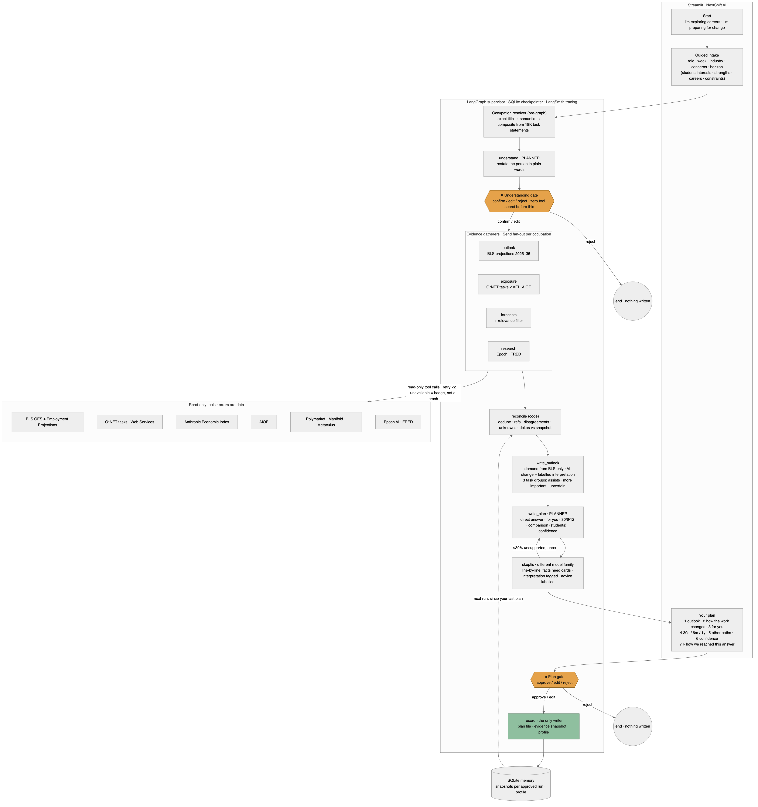

# NextShift AI — Week 3 project documentation
*Maven · Mastering Agentic AI · Week 3 "Build Your AI Agent" · Judy Darvin · submitted 2026-08-30*
*Paste into the Google Doc; sections follow the handout's required list (overview · datasets · prompts used · iterations · learnings). Diagrams: `design/architecture-diagram.png` (professional) · `design/architecture-student.png` (student interviewer). Repo: https://github.com/judy-eapen/nextshift-ai*

---

## 1. Overview

**One-liner (handout Part 2):** My agent helps a student who doesn't yet know what they want, or a professional worried about their role, plan a career for an AI-shaped job market in a web app — replacing hours of podcasts, headlines and Reddit threads that never say how confident anyone is or what to do. It restates what it understood about the person, gathers employment projections, task-level AI-exposure data and forecaster expectations in parallel using 10 read-only tools across 4 gatherers, writes a plan that leads with the answer, has a second model strip every line it can't verify, hands off to the person **before any evidence is gathered** (to confirm it understood them) and **before anything is saved**, and I'll know it works when a person gets a cited, actionable plan that addresses each of their stated concerns in under 10 minutes, 8 times out of 10.

**The problem.** Students don't know which fields will still offer meaningful work; professionals don't know whether their role will shrink, how it will change, or what to learn. The information exists — BLS projections, O\*NET task lists, Anthropic's data on what AI is actually used for, prediction markets on AI progress — but nobody assembles it for *one person's* situation, and the sources that do exist rarely say how sure they are.

**The product promise.** NextShift helps students and professionals understand how AI may change a career, whether demand is likely to grow or shrink, and what they can do now to build a more resilient future — without promising any career is "safe."

**What a student sees.** Start → *"You don't need to know what career you want yet"* → a career-discovery interview, one question at a time (8–12; the next question depends on what is still unclear, on contradictions, and on the student's choices: *I'm not sure · Skip · Recommend careers now · Ask me more · Edit an earlier answer*) → *"Here's what I understand about you"* in nine editable sections (gate 1; no career data has been gathered yet) → 8–10 career directions in three groups — strong matches · worth exploring · unexpected possibilities — each with a rationale that cites the student's own words, official outlook, education, how AI may reshape the work, human capabilities, a possible mismatch and evidence confidence → reactions (😀 🤔 ✕ + why) that update the profile → 0–2 discriminating questions → a shortlist with eight dimensions shown separately and "Our read" labelled as interpretation → a deep dive with ten sections including **Test this career before committing** → what-ifs (no grad school? salary? remote?) that reorder within the same candidates → save (gate 2).

**What a professional sees.** Start → two doors → 4-turn guided intake → *"Here's what I understood — fix anything that's off"* (gate 1) → plain-language progress → **Your plan**: direct answer · 1 outlook · 2 how the work may change · 3 what this means for you · 4 preparation plan (30 days / 6 months / 1 year) · 5 other paths · 6 confidence & uncertainty · 7 ▸ how we reached this answer → approve / edit / reject (gate 2) → saved; a later run shows what changed.

**How the system explains itself.** A sidebar *Your journey* indicator (nine student steps / seven professional) is derived from the graph's stage and node phase events — never from a timer — and flags *partial evidence* and *UNVERIFIED* where they actually occurred. *Open behind the scenes →* opens a dialog with three levels: *How NextShift works* (seven plain-language steps tagged [you] / [code] / [AI], with "you are here"), *What is saved?* (wording verified against the checkpoint and memory code — including that interview answers sit in a resumable session file before approval and go to the model provider), and *For builders* (architecture, model-assisted vs deterministic work, state and memory, failure handling, diagrams). Each career card offers *Why this appeared →*: what you told us (your quoted words) and career evidence, from the reviewed objects only — no score, nothing generated in the UI. Developer mode (`NEXTSHIFT_DEV=1`) is the only place model names, cost and node timings appear, and the only mode in which LangSmith tracing is on.

## 2. The agent framework (handout Part 2)

| Field | Answer |
|---|---|
| **Agent goal** | Take a person's role or interests, their concerns and a horizon; return a cited career plan: outlook, how the work changes, what to do in 30 days / 6 months / 1 year. |
| **Where used** | Web app (Streamlit). |
| **Steps, in order** | 1 Resolve the occupation (exact title → semantic → **composite** assembled from 18K O\*NET task statements when no category exists) → 2 restate what was understood → 3 **⏸ understanding gate** → 4 gather evidence in parallel, per occupation (outlook · exposure · forecasts · research) → 5 reconcile: dedupe, disagreements, unknowns, diff vs last snapshot → 6 outlook + three task groups (code) → 7 write the plan (planner model) → 8 reviewer strips unsupported lines (different model; one rewrite if >30%) → 9 render → 10 **⏸ plan gate** → 11 save plan + snapshot. |
| **Tools** | READ: `bls_projections(soc)` · `bls_oes` · `onet_tasks(soc)` · `onet_web_services` · `anthropic_index(soc)` · `aioe(soc)` · `polymarket_search` · `manifold_search` · `metaculus_search` · `epoch_recent` · `fred_series`. WRITE (gated): `save_plan`, `save_snapshot`, `save_profile`. INTERNAL: occupation resolver + task-statement matcher (Nebius embeddings), market relevance filter. |
| **Remembers** | Across sessions: profile + one evidence snapshot per *approved* run (SQLite) so the next run reports what moved. Within a run: the typed LangGraph state, checkpointed in SQLite (required for interrupts/resume). |
| **Never does** | Guarantee a job is safe or doomed · state a number not on a card · turn "AI is used for this task today" into "this task is automated" · infer a task "grows" from low AI usage · average disagreeing forecasts · invent a course or product · write anything before the plan gate. |
| **Human in the loop** | Professional: gate 1 (understanding) before any tool spend; gate 2 (plan) before save. Student: every interview question is an interrupt (answer · not sure · skip · recommend now · ask more · edit earlier), then the understanding gate, reactions, discriminating questions, shortlist choices, exploration and a save gate — seven interrupt kinds on one thread. All are LangGraph `interrupt`s resumed with `Command(resume=…)`. |
| **When something breaks** | Every tool returns `SourceResult(ok, cards, error, unknowns)` — never raises. Retry ×2 with backoff; then the source is marked *unavailable* and the plan carries a "Partial evidence" badge. No forecast → a cited *unknown*, never a number. Reviewer model down → citation-only check, flagged in the UI. Budget: 40 tool calls / $1. |
| **How I know it worked** | 12-case professional golden set plus a 24-case student sweep, both journeys, run end to end through both gates: ≥N cards, zero uncited factual lines, correct demand reading, unknowns/disagreements surfaced where expected, no write before approval, <10 min — plus a 5-point answer-quality rubric judged by the reviewer model (answers every concern · facts kept apart from interpretation · no guarantees · no invented products · concrete 30-day actions). **Result: professional 12/12 after two prompt fixes (median ~3 min; ~$0.01 per plan); student 24/24 (median ~9–10 min; ~$0.07 per exploration).** |

## 3. Architecture

**Pattern: two LangGraph graphs.** Professional: supervisor, 14 nodes, 2 interrupts (diagram above). Student: interviewer, 27 nodes, 7 interrupt kinds, one thread (`design/architecture-student.png`) — the interview loop is a conditional cycle (`select_question → interview_gate → update_profile → evaluate_completeness`) whose exit is decided in code.

**Model roles.** Six model-driven roles — *understand*, market *relevance filter*, *outlook interpreter*, *"more important" judge*, *plan writer* (all Qwen3-235B-Instruct via Nebius) and the *reviewer* (Qwen3-Next-80B **Thinking** — deliberately a different model family so review doesn't share the writer's blind spots) — plus four deterministic gatherers that fan out with `Send` per occupation and merge through reducers. Numbers, groupings and probability ranges are always computed in code over evidence cards; models write prose and judgments only.

**Why not a single agent** (iteration story below): I started single-agent; the parallel source calls were the latency bottleneck, and same-model self-review kept approving its own overreach. Splitting gatherers (independent work) and the reviewer (independent judgment) were the two justified reasons to go multi-agent.

**Runs entirely on open-weight models** through Nebius Token Factory.

## 4. Datasets and sources

| Family | Source | What it gives | Access |
|---|---|---|---|
| Outlook | **BLS Employment Projections 2025–35** (Table 1.2) | growth %, numeric change, annual openings, typical entry education | manual xlsx download (scripted download is 403'd) |
| Outlook | BLS OES 2025 | employment, median wage per SOC | API |
| Exposure | **O\*NET 31.0** task statements (17,998), occupation data, reported job titles (54K) | the task list per occupation; the title→SOC index | download + Web Services key |
| Exposure | **Anthropic Economic Index** | `task_penetration` — share of observed AI conversations touching each O\*NET task; `job_exposure` per occupation | HF download, pre-aggregated offline |
| Exposure | **AIOE** (Felten et al.) | AI occupational exposure score, LM variant | GitHub CSV |
| Forecasts | Polymarket · Manifold · Metaculus | market-implied probabilities on 6 curated anchor questions (AGI by horizon, drop-in AI workers, AI-driven unemployment, AI safety law, adoption) | public APIs; Metaculus aggregates gated for this account → honest `value=None` |
| Research | Epoch AI notable models · FRED | frontier-model releases; national unemployment | CSV · API |

Offline join: `data/processed/landscape.parquet` — 867 occupations × outlook × exposure (94% coverage). Embedding indexes (occupations; 18K task statements) built once with Nebius `Qwen3-Embedding-8B`.

## 5. Prompts used with Claude Code (vibe-coding log)

1. *"Read PLAN.md, GOOD_MORNING.md, graph/DESIGN.md and skim tools/schema.py and tools/smoke_test.py. Do not write code yet. Critique the proposed graph against PLAN.md's Sunday scope… propose the final State, nodes, edges, and the two interrupts. Stop and wait for me."* → design conversation first (instructor's advice); 10 changes to the overnight proposal.
2. *"Walk me step by step through what you have given me… like you're talking to somebody who doesn't understand any of it."* → the design explained as a story; three decisions made (persona resolution in the UI, model writes the brief but the skeptic checks the brief itself, six curated forecast anchors).
3. *"How many agents are there?"* → strict count (6 model-driven) vs loose count; the write-up line.
4. *"How valuable is this to someone today?"* → honest 5/10 as a product; led directly to leading with the task view and to the redesign.
5. *"Go, start building."* → Friday's graph, CLI, golden set 10/10.
6. *"This is not a PM job at all."* (screenshot) → discovered SOC has no Product Manager; resolver bug (`.00`-only index) fixed; then **composite occupations** from 18K task statements — "the government has no category for my job, so the agent assembled one and showed me its work."
7. *"Yes build it, do both."* → curated + description-built composites, tick-list.
8. *"You are helping me redesign the user experience… First critique… wait for my approval."* → the 11-part redesign proposal; approved with "student for Sunday as well."
9. *"Rerun g03 after the fix and show me the direct answer."* / *"How did g13 do?"* → eval-driven iteration overnight.

## 6. Iterations (what changed and why)

| # | What I tried | What happened | What I changed |
|---|---|---|---|
| 1 | Single agent, sequential tool calls | Slow; the one model approved its own overreach | Supervisor with parallel gatherers + separate reviewer model |
| 2 | Cheap 30B model as the market relevance filter | Kept "Will Powell say 'Unemployment'…" and "Will OpenAI *hint at* AGI" | Planner model, forced one-line *why* per market; announce-vs-happen markets kept only as labelled proxies |
| 3 | Sentence-level skeptic on prose paragraphs | Regex splitting produced uncited fragments; 50% stripped | One claim per line (bullets); evidence header generated by code |
| 4 | Residual probability for the "slow" scenario | Anchors aren't mutually exclusive → fake 5% | Dropped residual; then dropped scenarios as the headline altogether |
| 5 | "Product Manager" → Marketing Managers (where O\*NET files the title) | Task list was pricing, campaigns, trade shows — not a PM's week | Resolver over detailed codes; composites assembled from task statements; human ticks the tasks |
| 6 | `penetration × scenario multiplier → disappears / supervised / grows` | Indefensible: current usage ≠ automation; low usage ≠ growth | Three groups from observed use only; "more important" requires a stated reason and is tagged interpretation |
| 7 | Scenario tree as the result | Users couldn't find the answer | Answer-first plan; forecasts demoted to conditional context in §6 |
| 8 | Worldview gate (edit forecast anchors) | Asked the user to approve concepts they don't have | Understanding gate: confirm what the agent understood *about them*, before any tool spend |
| 9 | Reviewer stripped 52% of the student plan | Bug: refs above `c99` didn't match a 2-digit regex | Fixed; strip rate fell to 0–3% |
| 10 | Eval rubric said 30-day plans weren't actionable | Judge saw only the first 6,000 chars — never reached §4 | Pass the whole plan to the judge; all cases pass |
| 11 | Student intake as a 4-turn form asking for careers | Students who don't know were stuck | Adaptive interviewer: code picks the goal by coverage gap and contradictions, model words the question |
| 12 | Question writer told to "build on what they said" | Riffed on one moment for eight turns; constraints never asked | Topic lock: base question per goal, ≤8-word lead-in |
| 13 | Reviewer judged a Markdown shadow while the UI showed the structured object | Removed claims could still appear on screen | Structured review: flatten → judge → delete in the object the UI renders; export generated afterwards |
| 14 | Reviewer on 234 lines in one call (thinking model) | Output truncated → "unverified" | Batches of 12 in parallel, halving retry, raw-failure log; labels/ids skipped; rationale checked deterministically |
| 15 | "Nonprofit Program Coordinator" → Clinical Research Coordinators | Semantic match on a shared generic word | Reject matches that share only generic words below 0.72 similarity → composite instead |
| 16 | Architecture explained only in docs; the one in-app expander mixed model names and cost with unknowns and leaked raw log lines | Reviewers couldn't see the gates, the deterministic controls or why a card appeared; a privacy line ("nothing is stored until you approve") was inaccurate — answers are checkpointed to SQLite each turn and tracing was on | Progressive disclosure: journey indicator from real phase events · behind-the-scenes dialog (plain / what is saved / builders) · *Why this appeared* from reviewed data · developer mode gated by env, tracing follows it · copy pinned to code constants by tests |

## 7. Learnings

- **The hard part was never the prompt.** It was where the gates go, what a "unit of claim" is for the reviewer, and what to do when a source is down or a category doesn't exist.
- **Make numbers in code, prose in models.** Every defensible thing in the plan (demand reading, task groups, disagreement spread) is computed; the model only explains. This is what made the reviewer's job tractable.
- **A different model as reviewer catches real things** — "fully automated" from a 0.92 usage score, a card about AGI probability cited for a task claim — and also exposed my own bugs faster than I would have.
- **Honesty is a feature users notice.** "No official category exists for your job; here's what I assembled and how" landed better than any confident match. Same for "no forecast exists — not estimated."
- **The taxonomy gap is the thesis.** SOC 2018 has no Product Manager, Product Owner or Head of Product. Official statistics lag how modern work is organized, which is exactly why a tool like this is needed.
- **Explaining the system found an inaccuracy in it.** Writing "what is saved?" against the actual checkpointer showed the interview line was wrong (answers *are* written to a session file before approval) and that tracing sent student text to LangSmith by default. Accurate copy forced accurate behaviour.
- **Evals found the bugs I'd have shipped.** Two of the four first-pass failures were harness bugs, two were prompt gaps; none were visible in a happy-path demo.

## 8. Evaluation results (evals/results/)

**Student journey (24 cases, simulated students):** see `evals/student_golden.json` — no career ideas · three careers in mind · "I don't know" ×5 · recommend early · ask for more · edit the summary · correct an earlier answer · strict cost constraint · likes a field but dislikes its daily work · claimed vs demonstrated strengths · composite role · declining demand with many openings · BLS unavailable · Polymarket down · reviewer model down · reject profile · reject save · no write before approval · removed content absent from the UI · feedback changes the shortlist · concrete experiments · exploration preserves decisions · max turns · professional regression. Result: **24/24** across the sweeps (17 in the parallel sweep on current code, 7 rerun serially after a process stall; every case passes its deterministic checks and, where judged, the 5-point rubric). Median ≈ 9–10 min and ≈ $0.07 per full exploration when run alone; parallel runs share one Nebius endpoint and slow each other down — run evals with `EVAL_WORKERS=1` for timing.

**Professional journey (12 cases):**

12 cases · both gates · failure injection · memory (originally 13; g05, the old student 3-way comparison, was retired when the interviewer superseded it). First pass 9/13; after fixing the ref regex, the rubric truncation, and the plan prompt: **12/12**. Median ≈ 3 min per plan, ≈ $0.01 per plan on open-weight models. Details: `evals/golden.json`, `evals/run_golden.py`, `graph/DESIGN.md`.

## 9. Roadmap (one slide)

Adjacent-career paths from O\*NET ability/knowledge similarity (data already local) · skill-gap learning paths · economy/retirement lens · watch-list alerts when a snapshot moves · Kalshi/Metaculus prices when access is approved · Next.js front end for a product (backend unchanged).
